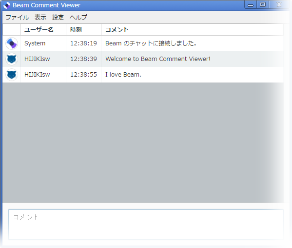

# Beam にも Comment Viewer を。

Beam 配信時にコメントを閲覧するためのアプリケーションです。棒読みちゃんと連携できます。

## 詳細

Beam ( https://beam.pro/ )で、自身の配信ページに書き込まれたチャットコメントをリアルタイムで閲覧するためのアプリケーションです。
みちあき 氏が作成された「棒読みちゃん ( http://chi.usamimi.info/Program/Application/BouyomiChan/ )」と連携することで、
書き込まれたチャットコメントを読み上げさせることも可能です。
ニコニコ生放送 ( 以下ニコ生 ) における「Niconama Comment Viewer」( 以下NCV ) の役割を Beam 上で果たす目的で開発されました。

当面は、Windows 7 / 8 / 8.1 / 10 が動作対象 OS となります。

## 過度な期待はしないで！

先述の通り、このアプリケーションはニコ生における NCV の役割を Beam 上で果たす目的で開発されましたが、
多機能な NCV とは違い、機能は至ってシンプルなものを目指しております。
自身の配信環境を整えることが最大の目的であるため、開発者自身が使用しない機能は実装されない傾向にあります。
ご意見、ご要望などをいただくことは大変嬉しい限りですが、その期待にそえないことも多々あるかと思いますので、
その点はご了承ください。

## 開発環境

NW.js v0.19.5

Required modules:
* beam-client-node
* node-machine-id

## ライセンス

このアプリケーションは MIT ライセンスのもとで配布されております。
したがって、改変・再配布などは自由に行っていただいて構いません。

## 免責事項

当アプリケーションを使用したことにより発生したいかなる損害も、製作者はその一切の責任を負わないものとします。

## おわりに

このアプリケーションがきっかけで Beam 配信が日本で普及することを願っています。
